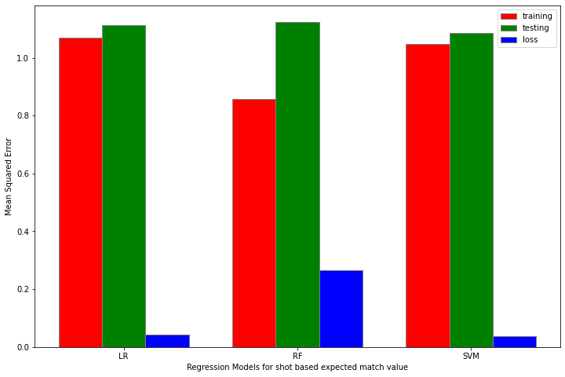
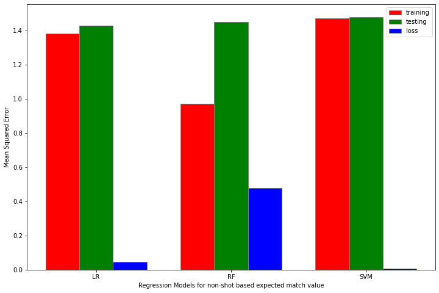
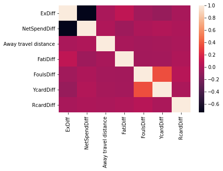
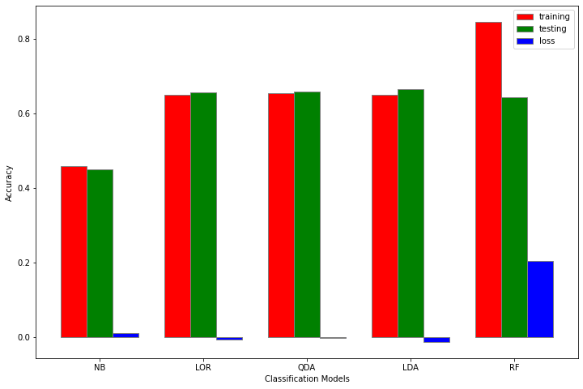

# Beat the Bookie: EPL Match Outcome Prediction

Machine learning pipeline for predicting English Premier League match outcomes (Home Win, Draw, Away Win) using custom feature engineering grounded in sports analytics. Achieves **66.5% testing accuracy** with Linear Discriminant Analysis — 2x better than random guessing on a 3-class problem.

Combines match statistics, web-scraped financial data, a custom ELO rating system, and domain-specific features like fatigue modelling and travel distance.

---

## Tech Stack

| Category | Technologies |
|---|---|
| **Language** | Python 3 |
| **ML Models** | scikit-learn (LDA, QDA, Logistic Regression, Naive Bayes, Random Forest, SVR) |
| **Hyperparameter Tuning** | GridSearchCV, 5-fold cross-validation |
| **Feature Selection** | Mutual Information, SelectKBest |
| **Web Scraping** | requests, BeautifulSoup (Transfermarkt financial data) |
| **Data Processing** | pandas, NumPy, SciPy |
| **Visualisation** | Matplotlib, seaborn |

---

## Architecture & Pipeline

```
┌──────────────────────────────────────────────────────────────────────┐
│                   MATCH PREDICTION PIPELINE                         │
│                                                                      │
│  ┌────────────────────────────────────────────────────────────┐     │
│  │  Data Sources                                              │     │
│  │  EPL match history (4,723 matches) + Transfermarkt         │     │
│  │  (spending data, web scraped) + Google Maps (distances)    │     │
│  └───────────────────────────┬────────────────────────────────┘     │
│                              v                                       │
│  ┌────────────────────────────────────────────────────────────┐     │
│  │  Feature Engineering                                       │     │
│  │                                                            │     │
│  │  ┌─────────────────────────────────────────────────────┐  │     │
│  │  │  Expected Match Value (xM)                           │  │     │
│  │  │  Shot-based regression (SVM) ──┐                     │  │     │
│  │  │                                ├─> 80/20 weighted    │  │     │
│  │  │  Non-shot regression (LR) ─────┘   combination       │  │     │
│  │  │  + Penalty adjustment (0.76 conversion rate)         │  │     │
│  │  └─────────────────────────────────────────────────────┘  │     │
│  │                                                            │     │
│  │  ELO Rating ──── Home/Away separated, season resets       │     │
│  │  Last N Points ─ Recent form (optimised at N=5)           │     │
│  │  Fatigue ─────── Sigmoid decay: 1/(1+exp(0.5*(days-3)))  │     │
│  │  Spending ────── Normalised expenses & net transfers      │     │
│  │  Distance ────── Away team travel (miles)                 │     │
│  └───────────────────────────┬────────────────────────────────┘     │
│                              v                                       │
│  ┌────────────────────────────────────────────────────────────┐     │
│  │  Feature Selection                                         │     │
│  │  Mutual Information → top 50% features retained:           │     │
│  │  ELO diff, Last N diff, Expense diff, Net Spend diff,     │     │
│  │  Away travel distance                                      │     │
│  └───────────────────────────┬────────────────────────────────┘     │
│                              v                                       │
│  ┌────────────────────────────────────────────────────────────┐     │
│  │  Model Selection                                           │     │
│  │  5 classifiers trained, cross-validated, hyperparameter    │     │
│  │  tuned → LDA selected (best accuracy, lowest gen. loss)   │     │
│  └───────────────────────────┬────────────────────────────────┘     │
│                              v                                       │
│  ┌────────────────────────────────────────────────────────────┐     │
│  │  Output: Match predictions with probability scores         │     │
│  │  (P(Home Win), P(Draw), P(Away Win))                      │     │
│  └────────────────────────────────────────────────────────────┘     │
└──────────────────────────────────────────────────────────────────────┘
```

---

## Feature Engineering

| Feature | Method | Detail |
|---|---|---|
| **Expected Match Value (xM)** | Dual regression | Shot-based SVM (80%) + non-shot Linear Regression (20%), weighted combination with penalty adjustment |
| **ELO Rating** | Custom rating system | Separate home/away ELO; updates based on xM difference; season resets regress toward 1500 |
| **Recent Form** | Last N points | Points from last 5 matches (W=3, D=1, L=0); N=5 optimised via testing |
| **Fatigue** | Sigmoid decay | `1/(1 + exp(0.5*(days - 3)))` — models tiredness from short rest between matches |
| **Spending** | Web scraping | Expenses and net transfers scraped from Transfermarkt, normalised per season |
| **Distance** | Geographic | Away team travel distance in miles (Google Maps data) |

---

## Results

### Regression Models (Expected Match Value)

**Shot-based xM** — SVM selected for lowest generalisation loss despite similar training MSE:



**Non-shot-based xM** — Linear Regression selected; Random Forest overfits heavily:



### Feature Correlation

Heatmap of engineered features — low inter-feature correlation confirms independent signals:



### Classification Models

**Model comparison** — LDA achieves the best testing accuracy with near-zero generalisation loss, while Random Forest overfits:



| Model | Training Accuracy | Testing Accuracy | Selected |
|---|---|---|---|
| **Linear Discriminant Analysis** | **84.6%** | **66.5%** | Yes |
| Quadratic Discriminant Analysis | Tested | Lower | No |
| Logistic Regression | Tested | Lower | No |
| Naive Bayes | Tested | Lower | No |
| Random Forest | High | Lower (overfitting) | No |

> LDA chosen for best testing accuracy and lowest generalisation loss across 5-fold CV.

---

## Key Design Decisions

| Decision | Rationale |
|---|---|
| Custom xM over raw stats | Inspired by xG in football analytics; captures match quality better than raw goals scored |
| Dual regression for xM | Shot-based and non-shot-based models capture different aspects of team performance |
| Home/away ELO separation | Teams perform differently at home vs away; single ELO loses this signal |
| ELO season reset | Prevents ratings from becoming stale across seasons (regresses 2/3 toward 1500) |
| Sigmoid fatigue model | More realistic than linear — tiredness is non-linear with diminishing returns past a threshold |
| Mutual Information for feature selection | Non-linear dependency detection; more robust than correlation for classification |
| LDA over Random Forest | RF had significantly higher generalisation loss despite similar training accuracy |

---

## Project Structure

```
├── BEATTHEBOOKIE.ipynb    # Full pipeline: data processing, feature engineering,
│                          # model training, evaluation, and prediction
└── README.md
```

---

## Getting Started

```bash
git clone https://github.com/jiayihuang1/Beat-The-Bookie.git
cd Beat-The-Bookie

pip install pandas numpy scikit-learn matplotlib seaborn requests beautifulsoup4 scipy

jupyter notebook BEATTHEBOOKIE.ipynb
```

The notebook runs end-to-end: data loading, feature engineering, model comparison, and final predictions output to CSV.
